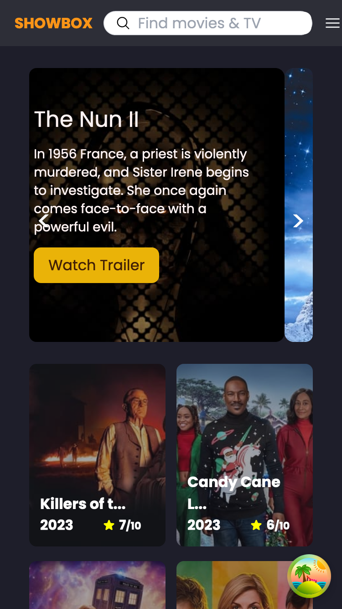

# ShowBox

Welcome to the ShowBox! This application allows users to explore movie details, bookmark their favorite movies, and add them to a watchlist.

## Table of Contents

- [Features](#features)
- [Screenshot](#Screenshot)
- [Technologies Used](#technologies-used)
- [Useful Resources](#useful-resources)
- [License](#license)

## Features

- **Movie Details:** View detailed information about each movie, including title, release year, and other relevant details.

- **Bookmarking:** Bookmark your favorite movies to easily access them later.

- **Watchlist:** Add movies to your watchlist to keep track of movies you plan to watch.

### Screenshot

|  |  |
| --------------------------------------------------- | -------------------------------------------------- |

## Technologies Used

- HTML
- React
- React Router (for navigation)
- Redux (for state management)
- Tailwind CSS (for styling)

## Useful Resources

- [React Documentation](https://react.dev/): Official documentation for React.

- [React Router Documentation](https://reactrouter.com/en/6.20.1): Learn how to use React Router for navigation.

- [Redux Documentation](https://redux.js.org/introduction/getting-started): Official documentation for Redux state management.

- [OpenAI GPT-3 Documentation](https://beta.openai.com/docs/): Explore the documentation for ChatGPT's underlying technology.

- [Tailwind CSS Documentation](https://tailwindcss.com/docs): Explore the documentation for Tailwind CSS.

- [Google Fonts](https://fonts.google.com/): Browse and integrate beautiful fonts for your project.

- [Stack Overflow](https://stackoverflow.com/): A community of developers helping each other with coding problems.

## License

This project is licensed under the [MIT License](LICENSE).
